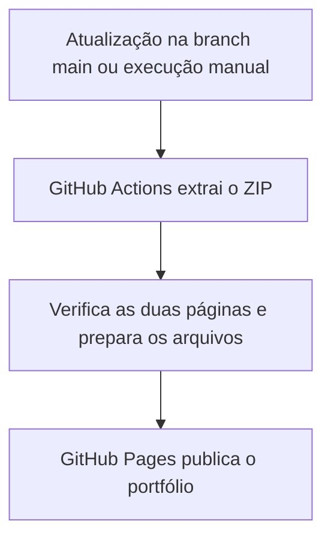

# Vitor Santos Ferreira
### Portfólio profissional · Comercial, tecnologia e soluções digitais

Uma apresentação objetiva de experiências, projetos, competências e formação — com acesso aos comprovantes de cursos e eventos.

**[Acessar o portfólio](https://santosferreiravitor427-ux.github.io/Portfolio/) · [Ver certificados](https://santosferreiravitor427-ux.github.io/Portfolio/certificados.html) · [LinkedIn](https://www.linkedin.com/in/vitor-santos-1474583b3/)**

**HTML5 · CSS3 · GitHub Actions · GitHub Pages**

---

## O objetivo

Reunir minha atuação comercial e meu repertório em tecnologia em um endereço que possa ser compartilhado com recrutadores. O conteúdo prioriza o que ajuda a avaliar meu perfil: responsabilidades profissionais, exemplos de projetos, competências, formação e formas de contato.

## O que você encontra

| Seção | Conteúdo |
| --- | --- |
| **Perfil profissional** | Apresentação curta, conectando comunicação, negócios e tecnologia. |
| **Experiência** | Quatro experiências: AluForce / Cobal, R.B Serviços e Soluções Financeiras, Grupo Reart e NeyCar Veículos. |
| **Projetos** | Protótipo comercial da NeyCar, pesquisa acadêmica sobre qualidade de conexão e prototipação em equipe. |
| **Competências** | Prospecção, negociação, relacionamento, organização e tecnologia aplicada. |
| **Formação** | Graduação em Análise e Desenvolvimento de Sistemas e cursos complementares. |
| **Certificados** | Galeria com oito comprovantes, prévias e links para os documentos em PDF. |
| **Contato** | Acesso direto ao LinkedIn, e-mail e WhatsApp. |

## Como o projeto foi feito

### 1. Direção e organização do conteúdo

O ponto de partida foi uma imagem de capa fornecida por mim. A proposta visual e o conteúdo foram refinados com apoio do ChatGPT/Codex e minha revisão: apresentação profissional objetiva, ampliação das experiências e formações e criação da galeria de certificados.

A organização diferencia experiências profissionais, protótipos e trabalhos acadêmicos. Os cursos são apresentados como cursos concluídos; por exemplo, o comprovante do curso AI-900 não é descrito como aprovação no exame oficial da Microsoft.

### 2. Identidade visual

A capa orientou a combinação de **azul escuro, verde vibrante e tons claros**. A interface usa títulos grandes, seções numeradas e cartões para facilitar a leitura.

- **Space Grotesk** nos títulos e **DM Sans** nos textos.
- Imagens em **WebP** para a capa e as prévias dos certificados.
- Layout com **CSS Grid**, **Flexbox** e ajustes para telas menores.
- Navegação por seções e chamadas diretas para projetos e contato.

### 3. Construção das páginas

O site foi implementado em **HTML e CSS**, sem framework ou servidor de aplicação. São duas páginas principais: o portfólio e a galeria de certificados.

O código inclui estrutura semântica, link para pular ao conteúdo, indicação visual de foco no teclado e respeito à preferência de redução de movimento. Os certificados publicados receberam ocultação dos identificadores pessoais presentes nas cópias que precisavam desse cuidado.

### 4. Publicação gratuita

Os arquivos foram organizados no pacote `portfolio-vitor-github.zip`. O workflow em [`.github/workflows/pages.yml`](.github/workflows/pages.yml) prepara e publica o conteúdo no GitHub Pages.

O processo utiliza `actions/checkout`, `actions/upload-pages-artifact` e `actions/deploy-pages`. O endereço público utiliza HTTPS.

### 5. Verificação

Na publicação inicial, a execução do workflow foi concluída com sucesso. A página principal e a galeria de certificados foram abertas no endereço público, e os caminhos locais dos arquivos do pacote foram conferidos.

## Organização dos arquivos

O repositório contém o pacote do site, esta apresentação e o workflow. **As páginas e imagens estão dentro do ZIP.**

| Arquivo dentro do pacote | Função |
| --- | --- |
| `index.html` | Página principal do portfólio. |
| `styles.css` | Identidade visual e layout responsivo. |
| `certificados.html` | Galeria dos oito comprovantes. |
| `certificados.css` | Estilos da galeria. |
| `capa-vitor.webp` e `capa-sem-arroba.webp` | Imagens utilizadas na composição da capa. |
| `certificados/` | PDFs e prévias em WebP. |
| `.nojekyll` | Arquivo auxiliar para hospedagem estática. |

## Como atualizar

1. Baixe e extraia `portfolio-vitor-github.zip`.
2. Edite os textos, estilos ou documentos desejados.
3. Compacte novamente **o conteúdo da pasta**, mantendo `index.html` na raiz do ZIP.
4. Substitua `portfolio-vitor-github.zip` neste repositório e confirme a alteração na branch `main`.
5. Acompanhe a publicação na aba **Actions**. O link do site permanece o mesmo.

Para visualizar localmente, extraia o pacote e abra `index.html` no navegador.

---

**Comunicação · Vendas consultivas · Tecnologia aplicada · Projetos digitais**

[Conheça o portfólio completo →](https://santosferreiravitor427-ux.github.io/Portfolio/)

